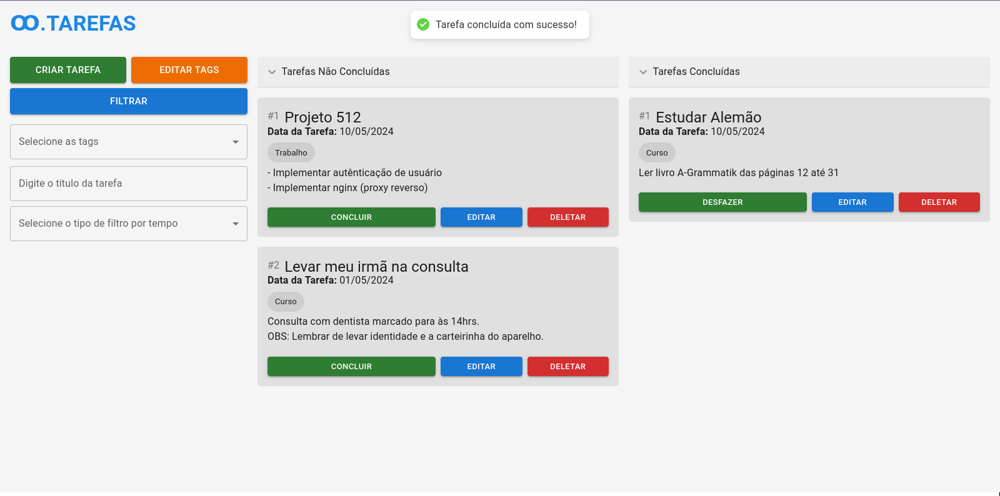

# Desáfio Técnico Diel

 

 <a href="#-o-que-foi-implementado">⚙️ O que foi implementado</a>&nbsp;&nbsp;&nbsp;|&nbsp;&nbsp;&nbsp;
 <a href="$-o-que-pode-ser-melhorado">🛠️ O que pode ser melhorado</a> 
 <a href="#-como-foi-desenvolver">✨ Como foi desenvolver</a>&nbsp;&nbsp;&nbsp;|&nbsp;&nbsp;&nbsp;
 <a href="#-como-rodar">💻 Como rodar</a>&nbsp;&nbsp;&nbsp;|&nbsp;&nbsp;&nbsp;

 

Meu foco principal neste desáfio foi implementar uma arquitetura limpa, utilizando conceitos de injeção de dependências, camadas de domínio, casos de uso e etc, utilizando uma abordagem que melhor se identifica com o desáfio proposto. No que tante a escalabilidade, não foi implementado features que fornaçam grande diferença na performance, porém no back-end poderiamos utilizar um servidor de proxy como o Nginx (que estou aprendendo atualmente).
 
## 💻 O que foi implementado?

- Tarefas: criação, remoção, edição, marcar como concluído ou não, filtros avançados (por título, mês, semana, dia e etc.)
- Tags: criação, remoção e edição
- Usuário: criação e autênticação

Optei por não implementar a 'duração', pois no formato que fiz, não faria tanto sentido haver um atributo do tipo. Além disso, não implementei o gráficos, pois foi difícil conciliar universidade e estágio (atual), porém da forma que implementei as entidades, essa feature é relativamente fácil para implementar. Pretendo realizar em breve. 

## 🛠️ O que pode ser melhorado

- Implementar todos os requisitos funcionais do desafio.
- Implementar load-balancer através do Nginx.
- Encapsular os serviços em uma imagem docker.
- Adicionar listagem virtualizada ou com paginação das tarefas.
- Criar um hook personalizado apenas para os dados que serão servidos ao invés de misturar com os dados de autênticação.
- Utilizar novos recursos do framework utilizado (server components e etc.)
- Melhorar a manipulação de datas

## ✨ Como foi desenvolver?

Desenvolver essa aplicação foi como uma montanha russa. Ao mesmo tempo que algumas features são extremamentes fáceis para implementar, outras levam tempo apesar de aparentarem ser simples. 

Cito como exemplo, a criação de tarefas que neste caso tem uma data como atributo. Neste caso, como foi preciso salvar o dado no formate 'Date', foi preciso lidar com horários de zonas diferentes e muitas vezes a conversão criava certa confusão na minha cabeça. No filtro, por exemplo, quando filtrava por semana, os dados eram inconsistentes.

Além disso, foi um espaço importante para relembrar conceitos que havia estudado no passado e por questões de tempo não havia aplicado no meu dia a dia. Portanto, tive uma ótima experiência.

## 💻 Como rodar

- Clone o repositório com `git clone git@github.com:joaocansi/desafio-tecnico-diel.git`
- Entre na pasta do projeto
- Inicie o servidor:
  - Entre na pasta **server**
  - Instale as dependências com `yarn` ou `npm install` 
  - Inicie o banco de dados com `docker-compose up`
  - Rode o comando `yarn dev` ou `npm run dev`
- Inicie o site:
  - Entre na pasta **web**
  - Instale as dependências com `yarn` ou `npm install` 
  - Rode o comando `yarn dev`
- Acesso o site ([http://localhost:3000](http://localhost:3000/logar))
